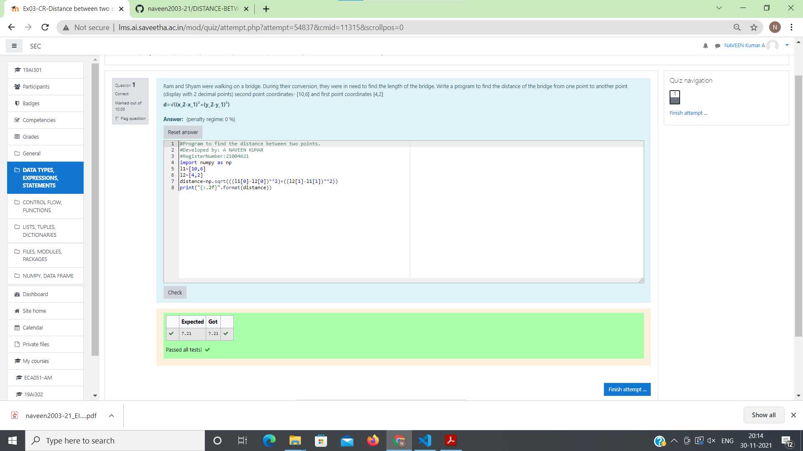

# DISTANCE-BETWEEN-TWO-POINTS

## AIM:
To write a python program to find the distance two 2 points
## ALGORITHM:
### Step 1: 
Get the two values from the user.
### Step 2:
Prepare the program for distance between two points 
### Step 3: 
Substitute the values in the distance formula 

### Step 4: 
Print the values using distance formula
### Step 5: 
End the program
### PROGRAM:
~~~
#Program to find the distance between two points.
#Developed by: A NAVEEN KUMAR
#RegisterNumber:21004621
import numpy as np
l1=[10,6]
l2=[4,2]
distance=np.sqrt(((l1[0]-l2[0])**2)+((l2[1]-l1[1])**2))
print("{:.2f}".format(distance))
~~~
### OUTPUT:

### RESULT:
Thus the distance between two points are successfully executed.
